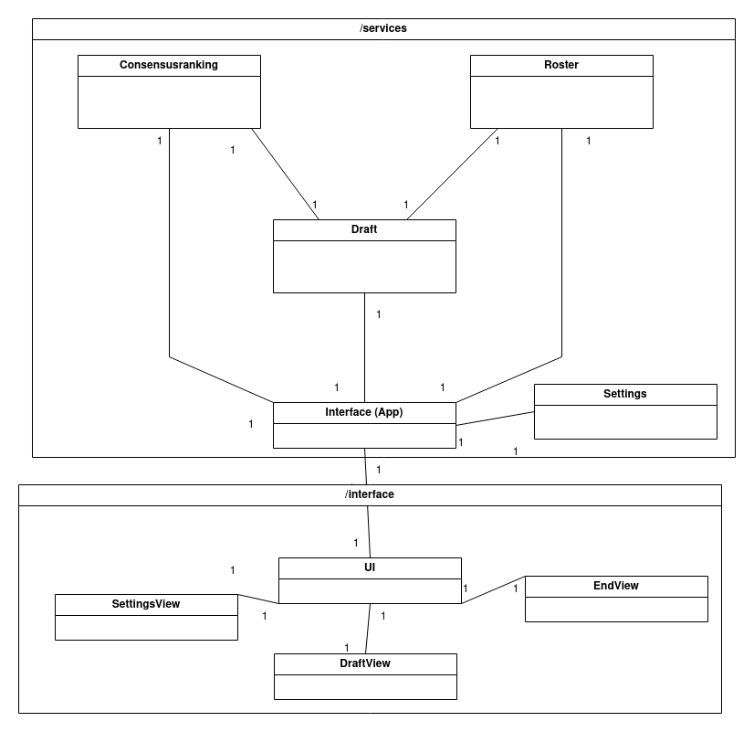

# Arkkitehtuurikuvaus

## Luokkakaavio

## Sovelluslogiikka

Tämän hetkisessä versiossa Interface luokka alustaa muut luokat ja käynnistää Draft luokassa pyörivän sovelluslogiikan. Settings luokka mahdollistaa käyttäjälle oman liigan koon, sekä oman varausvuoron määrittämisen. Draft luokka on hakee ja tallentaa tietoa sekä Consensusranking, että Roster luokkiin. Draft luokka hoitaa ohjelman toiminnallisuuden ja käyttäjälle näkyvät toiminnot. Consensusranking luokka pitää yllä CSV tiedostosta haettua tietokantaa, joka on tallennettu Pandas Dataframena. Roster luokka ylläpitää tietoa jo valituista pelaajista, sekä hallinnoi pelipaikka kohtaisia suositus pelaajamääriä.
