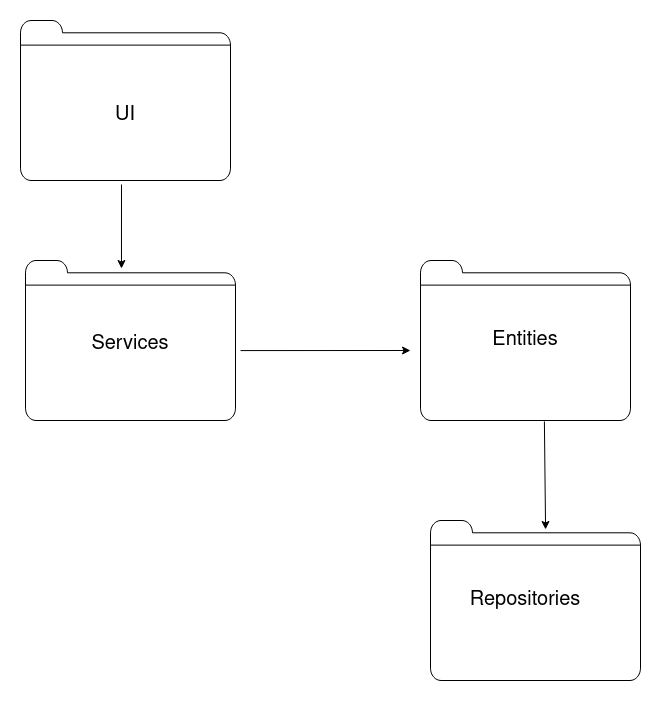
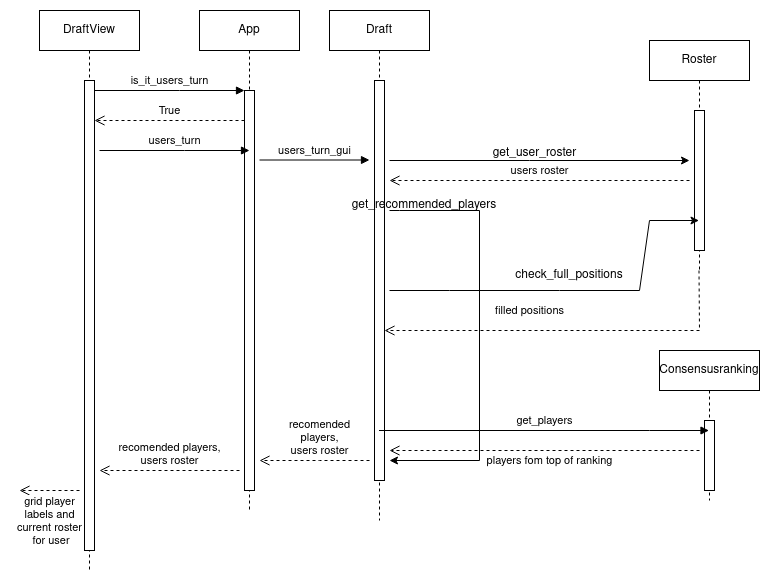

# Arkkitehtuurikuvaus

## Sovelluksen rakenne

Sovelluksen pakkausrakenne on rakennettu siten että _services_ pakkaus sisältää sovelluslogiikkaan liittyvät luokat, joiden kautta kulkee valtaosa sovelluksen tapahtumista. _UI_ pakkaus sisältää graafiseen käyttöliittymään liittyvät luokat. _Entities_ pakkauksesta löytyvät sovelluksen toiminnan aikana tietoa tallentavat ja säilövät luokat ja _Repositories_ sisältää luokat jotka lataavat tietoa CSV tiedostoista ja tallentavat tietoa tarvittaessa lopuksi TXT tiedostona.

## Käyttöliittymä

Sovelluksesta on olemassa kaksi eri versiota, enemmän ominaisuuksia tarjoava englanninkielinen graafinen käyttöliittymä ja suomenkielinen tekstipohjainen käyttöliittymä.

### Tekstipohjainen käyttöliittymä

Tekstipohjaisen käyttöliittymän sovelluslogiikka ja käyttöliittymä toimivat pääasiassa [Draft](../src/services/draft.py) luokassa. Tietojen käytön aikainen tallentaminen on eriytetty, mutta käyttöliittymä ja sovelluslogiikka toimivat valtaosin samassa luokassa.

### Graafinen käyttöliittymä

Graafinen käyttöliittymä tarjoaa kolme eri näkymää:

- Asetus näkymä
- Varaustilaisuus näkymä
- Yhteenveto näkymä

Nämä kaikki on toteutettu erillisinä luokkina ja niitä hallinnoi [UI](../src/ui/ui.py) luokka, joka vastaa muiden myös näkymä luokkien konstruktuoinnista sekä [App](../src/services/interface.py) luokan injektoinnista konstruktorikutsun yhteydessä. [DraftView](../src/ui/views/draft_view.py) luokka on käytössä suurimman osan aikaa sovellusta käytettäessä ja se kutsuu suoraan App luokan metodeja, osallistuen myös varaustilaisuuden toiminnallisuuteen. Käyttöliittymän käyttämät tyylimäärittelyt on toteutettu omassa [Style](../src/ui/styling/styles.py) luokassa. Lisäksi graafisessa käyttöliittymässä on tarjolla menu barin avulla toteutettu lisäasetus näkymä omassa [Options](../src/ui/views/options.py) luokassaan, jonka arvojen muuttaminen ei ole välttämätöntä sovelluksen käytön kannalta. Lisäasetus näkymä on toteutettu [SettingsView](../src/ui/views/settings_view.py) luokan konstruktuoimana TopLevel näkymänä.

Käyttöliittymän luokat pääosin pelkästään näyttävät tietoa, jonka ne saavat kutsumalla [App](../src/services/interface.py) luokan metodeja. Asetus- ja lisäasetus näkymistä tallennettavat tiedot välitetään entities pakkauksen luokille App luokan kautta. Suurin sovelluslogiikan toiminnallisuus joka käyttöliittymän luokille on jätetty on [DraftView](../src/ui/views/draft_view.py) luokan suorittama varaustilaisuuden silmukan toiminta `check_draft_position` metodissa.

## Sovelluslogiikka

### Tekstikäyttöliittymä versio

 [App](../src/services/interface.py) luokka konstruktuoi muut luokat ja käynnistää [Draft](../src/services/draft.py) luokassa pyörivän sovelluslogiikan. [Settings](../src/entities/settings.py) luokka mahdollistaa käyttäjälle oman liigan koon, sekä oman varausvuoron määrittämisen. Draft luokka hakee ja tallentaa tietoa sekä [Consensusranking](../src/entities/consensusranking.py), että [Roster](../src/entities/roster.py) luokkiin. Draft luokka hoitaa ohjelman toiminnallisuuden ja käyttäjälle näkyvät toiminnot. Consensusranking luokka pitää yllä CSV tiedostosta haettua tietokantaa, joka on tallennettu Pandas Dataframe muodossa. Roster luokka ylläpitää tietoa jo valituista pelaajista, sekä hallinnoi pelipaikka kohtaisia suositus pelaajamääriä.

### Graafisen käyttöliittymän versio

Graafisessa käyttöliittymässä [App](../src/services/interface.py) luokka konstruktuoi [UI](../src/ui/ui.py), [Draft](../src/services/draft.py), [Roster](../src/entities/roster.py) ja [Consensusranking](../src/entities/consensusranking.py) luokat ja injektoi tarvittavat luokat toisilleen konstruktori kutsujen yhteydessä.

[App](../src/services/interface.py) luokka toimii pääasiassa tiedon välittäjänä, kuitenkin esimerkiksi pitäen kirjaa varausvuoroista ja tarjoten DraftView luokalle tiedon käyttäjän varausvuorosta `is_it_users_turn` metodin kautta ja varaustilaisuuden päättymisestä `is_draft_done` muuttujan avulla. Varaustilaisuuden jokaisella vuorolla valitaan yksi pelaaja, joka riippuen siitä, onko simuloidun joukkueen vuoro valita vai käyttäjän, toimii käyttäen eri metodeja. Simuloidussa valinnassa DraftView kutsuu App luokan `bot_turn` metodia. App luokka tietää minkä joukkueen varausvuoro on käynnissä ja pyytää Draft luokalta arvotun pelaajavalinnan. Draft luokan `bot_turn` metodi suorittaa valittavan pelaajan arpomisen ja välittää tiedon kokoonpanoon lisättävästä pelajaasta Roster luokalle, joka tallentaa tiedon. Tieto valitusta pelaajasta palautetaan App luokalle, joka välittää sen edelleen DraftView luokalle näytettäväksi näkymässä.

[Draft](../src/services/draft.py) luokka sisältää varausvuoroon liittyvän toiminnallisuuden, hakemalla pelaaja- ja kokoonpanotietoja Roster ja Consensusranking luokilta ja suodattaen näistä tiedoista halutun kaltaisen vastauksen. Luokka hakee käyttäjälle tilanteeseen soveltuvat suositeltavat pelaajat ja välittää ne eteenpäin (kts. sekvenssikaavio) ja käyttäjän tehtyä valinnan, välittää tiedon eteenpäin Consensusranking ja Roster luokille. Luokan metodi `bot_turn` suorittaa simuloidulla varausvuorolla arvonnan parhaimpien pelaajien joukosta ja palauttaa valinnan käyttäjän nähtäväksi App ja DraftView luokkien kautta.

[Roster](../src/entities/roster.py) luokka pitää sovelluksen käytön aikana yllä ajantasaista tietoa, kunkin joukkueen kokoonpanosta, sekä pelipaikka kohtaista laskentaa. Tiedot on tallennettu listoihin ja sanakirjoihin. Varaustapahtuman lopuksi, jos käyttäjä halua tallentaa varaustilaisuuden aikana valitut kokoonpanot, välittää luokka tiedot [RosterRepository](../src/repositories/roster_saver.py) luokalle, joka tallentaa tiedot TXT tiedostoon.

[Consensusranking](../src/entities/consensusranking.py) luokka pitää yllä ajantasaista tietoa pelaajista, jotka ovat vielä varattavissa. Luokka saa listauksen pelaajista [ConsensusRankingRepository](../src/repositories/ranking_loader.py) luokalta, joka riippuen käyttäjän valitsemasta asetuksista lukee yhden kolmesta mahdollisesta CSV tiedostosta tallentaen tiedot Pandas Dataframe muotoon. Dataframe välitetään Consensusranking luokalle, joka hallinoi sitä sovelluksen käytön ajan. Pandas Dataframe mahdollistaa myös jatkokehityksessä helposti lisä informaation saamisen näytettäväksi käyttäjälle, joskin nykyisessä versiossa sen ominaisuuksia käytetään rajatusti.

## Päätoiminnallisuudet
Seuraavassa muutamia sovelluksen päätoiminnallisuuksia graafisesa käyttöliittymässä sekvenssikaavioina, jotka pyrkivät antamaan kuvan luokkien välisestä toiminnasta.

### Käyttäjälle ehdotettavien pelaajien hakeminen

Käyttäjän vuoron ollessa kyseessä suoritetaan ensin kysely suositeltavista pelaajista, joka noudattaa kuvan sekvenssikaavion toimintaa. DraftView luokka tarkistaa onko käyttäjän vuoro, jos on kutsuu se App luokan `users_turn` metodia. App luokka kutsuu edelleen Draft luokan `users_turn_gui` metodia. Draft luokka hoitaa suurimman osan logiikasta tässä kyselyssä ja App luokka toimii tiedon välittäjänä. Draft luokka hakee Roster luokalta käyttäjän sen hetkisen kokoonpanon ja tallettaa sen muuttujaan, kutsuen omaa `get_recommended_players` metodiaan. Metodi tarkistaa Roster luokalta vielä täytetyt pelipaikat, jotka se välittää edelleen Consensusranking luokalle `get_players` metodin argumenttina. Consensusranking palauttaa kolme sen hetkisen listan parhaimmaksi arvioitua pelaajaa ottaen huomioon täytetyt pelipaikat. Draft luokka palauttaa nämä pelajaat ja käyttäjän kokoonpanon App luokalle, joka päivittää varaustilaisuuden vuoroseurannan ja palauttaa suositellut pelaajat ja käyttäjän kokoonpanon edelleen DraftView luokalle näytettäväksi käyttäjälle.
