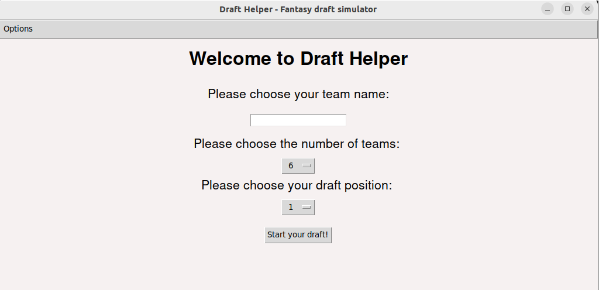
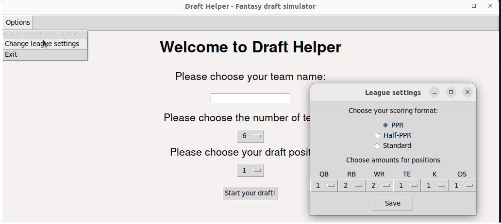
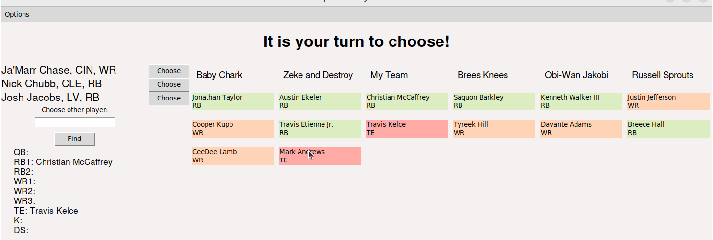
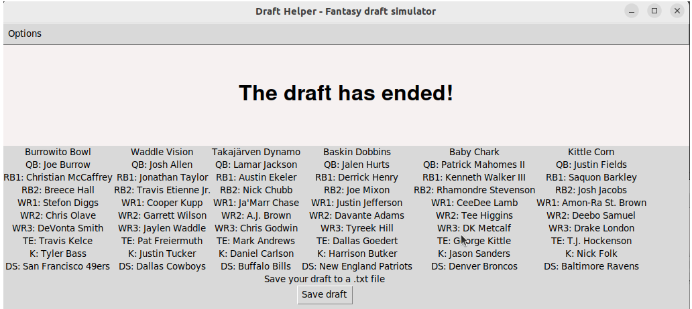

# Draft Helper käyttöohje

Lataa ohjelman lähdekoodin viimeisin [release](https://github.com/eepek/drafthelper/releases/tag/viikko5)

## Ohjelman asennus ja käyttö

Kaikki seuraavat komennot tulee suorittaa drafthelper-app kansiossa

### Asennus ja suoritus:

Asenna riippuvuudet komennolla:

```bash
poetry install
```

Käynnistääksei graafisen käyttöliittymän version suorita komento:

```bash
poetry run invoke start
```

Jos haluat käyttää ohjelmaa tekstikäyttöliittymällä suorita komento

```bash
poetry run invoke start-txt
```

## Tarkoitus

Draft Helper on tarkoitettu amerikkalaisen jalkapallon NFL-liigan fantasia joukkueiden varaustilanteiden simuloimista varten. Voit harjoitella varaustapahtumaa varten eri varauspositioista ja myös erilaisilla joukkuemäärillä, pisteytyksillä ja kokoonpanoilla. Bottipelaajat simuloivat muitten joukkueiden toimintaa, painottaen kuitenkin valintansa aina parhaimmaksi arvioitua pelaajaa kohtaan.

## Käyttö




Ohjelma kysyy aluksi sinulta liigasi koon ja oman varausvuorosi. Nämä tallennettuasi pääset käynnistämään draft tapahtuman.
Options valikosta löydät mahdollisuuden muuttaa pelaajien suositusjärjestyksen oman liigasi pistetytyksen mukaiseksi, sekä valitsemaan pelipaikkakohtaisesti tarjolla olevista vaihtoehdoista liigasi mukaiset pelipaikkakohtaiset pelaajamäärät.



Draft tapahtumassa omalla vuorollasi pääset valitsemaan ehdotetuista pelaajista omaan kokoonpanoosi pelaajan, tai voit hakea pelaaja nimellä. Pelaajalla nimellä haettaessa isoilla ja pienillä kirjaimilla ei ole väliä. Nimen jälkeen tulevat II, JR yms. eivät ole tarpeellisa, esimerkiksi Patrick Mahomes II löytyy kirjoittamalla hakukenttään pelkästään Patrick Mahomes.

Tietokonepelaajat valitsevat omalla vuorollaan parhaiksi arvioiduista pelaajista omaan kokoonpanoonsa pelaajat simuloiden oikeaa draft tapahtumaa.



Kun varaustilaisuus on saatu päätökseen, ohjelma näyttää sinulle vielä kaikkien joukkueiden lopulliset kokoonpanot. Tässä näkymässä voit _save_ nappia painamalla myös tallentaa varatut joukkueet .txt tiedostoon, joka tallentuu kansioon /save_files. Voit halutessasi _open_ nappia painamalla avata tiedoston suoraan ohjelmasta.