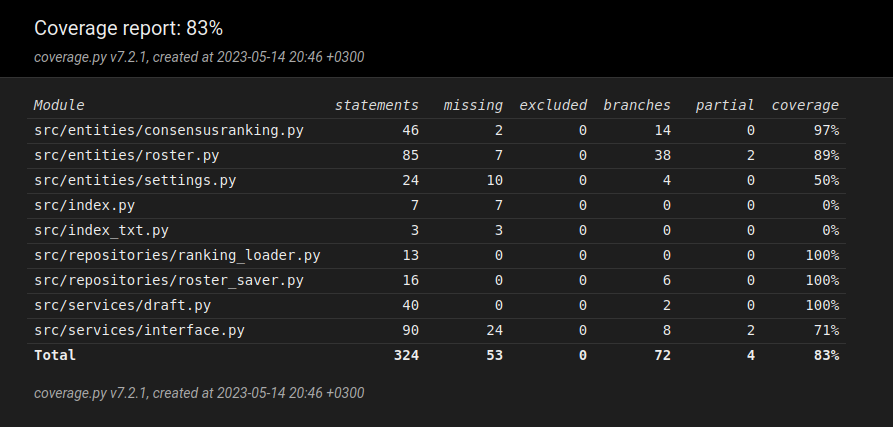

# Sovelluksen testit

Sovellus sisältää käyttäjän antamiin syötteisiin liittyvät järjestelmätason testit, joitten toimivuutta on testattu erilaisilla syötteillä sekä teksti- että graafisessa käyttöliittymässä. Automatisoitu testaus on toteutettu Unittestillä.

## Automatisoidut testit

### Sovelluslogiikka

Sovelluslogiikasta vastaavia [App](../src/services/interface.py) ja [Draft](../src/services/draft.py) luokkia testataan [TestInterface](../src/tests/interface_test.py) ja [TestDraft](../src/tests/draft_test.py) luokilla. Nämä molemmat konstruktoivat App luokan, jonka kautta konstruktuoidaan muut tarvittavat luokat. Koska suurin osa luokkien metodeista on yhteydessä johonkin toiseen luokkaan, saatiin myös testattua hyvin ristiin metodien toimintaa
eri luokissa

### Sovelluksen käytön aikainen tallennus ja pitkäaikaistallennus

[Consensusranking](../src/entities/consensusranking.py) luokkaa testaa [ConsensusrankingTest](../src/tests/consensusranking_test.py) luokka, [Roster](../src/entities/roster.py) luokkaa [TestRoster](../src/tests/roster_test.py) luokka ja [Settings](../src/entities/settings.py) luokkaa [TestSettings](../src/tests/settings_test.py) luokkka. Consensusranking ja Roster luokkien kautta testataan myös [ConsensusrankingRepository](../src/repositories/ranking_loader.py) luokka ja [RosterRepository](../src/repositories/roster_saver.py) luokat. ConsensusrankingRepository luokkaa testataan vain sovelluksen olemassa olevilla CSV tiedostoilla ja RosterRepository luokasta tarkistetaan, että se tallentaa oikean nimisen tiedoston oikeaan hakemistoon.

Koska monet luokkien metodit ovat yhteydessä toisiinsa, myös näitten testien avulla saatiin monen luokan metodeja testaavia testejä aikaan. Settings luokan testikattavuutta tiputtaa sen toiminnallisuus myös tekstiversiossa käyttöliittymänä. Käyttäjän syötteen vaativia metodeja ei lähdetty testaamaan.

### Testikattavuus

Haaraumakattavuudeksi saatiin 83%, johon eivät kuulu käyttöliittymä luokat. Testikattavuutta saaataisiin nostettua vielä lisää laatimalla monimutkaisempia kaikkien luokkien läpikäyviä testejä. Haasteita testien laatimisen kanssa loi, ohjelman vaatima käyttäjän syöte useammassa kohdassa, satunnainen arvonta simuloiduissa varausvuoroissa ja yleisesti varaustilaisuuden silmukkaan perustuva rakenne.

## Järjestelmätestit

Käyttäjän syötteen vaatimia toiminnallisuuksia on testattu sekä teksti- että graafisessakäyttöliittymässä oikeilla, väärillä ja tyhjillä syötteillä.
Kaikkia [vaatimusmäärittely](vaatimusmaarittely.md) dokumentin toiminnallisuuksia on myös testattu.

Sovellus on haettu ja testattu linux käyttöjärjestelmässä asentaen se käyttöohjeen mukaisesti

## Tiedossa olevat laatuongelmat

Sovellus ei osaa käsitellä tilannetta, jossa CSV tiedostot joista pelaajadata haetaan puuttuvat.
Tallennus ei toimi, mikäli /save_files kansio puuttuu.
